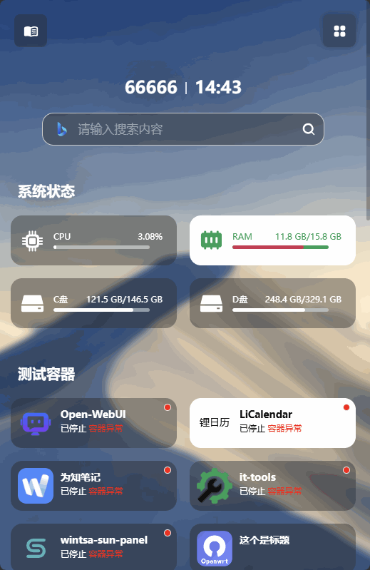

# Sun-Panel TOC 
[Sun-Panel](https://sun-panel.top) JavaScript plugins.

## 说明
提取所有分组作为侧边栏目录，点击可以快速跳转到指定分组。需要在 Sun-Panel `v1.5.2-beta24-08-10` 及以上版本。

## 效果

按钮触发效果




侧边栏效果


## 配置说明

部分配置可以在 [toc.js](./toc.js) 配置区域查看到

```js

  // =========== Config Start ===========
  // ------------------------------------
  // 距离滚动偏移量
  const scrollOffset = 80

  // 显示风格( auto:自动(默认) | mobile:左上角显示触发按钮-移动端风格 | sidebar:常态显示侧栏)
  const displayStyle = 'auto'

  // 移动端宽度定义
  const mobileWidth = 800

  const SunPanelTOCDomIdName = 'sun-panel-toc-dom'

  // 左上角按钮 SVG 图标
  const svgTocMobileBtn = '...'

  // ------------------------------------
  // =========== Config End ===========
```

## 安装教程

参考 [README.md](../README.md)